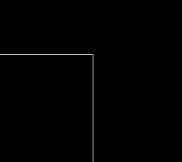
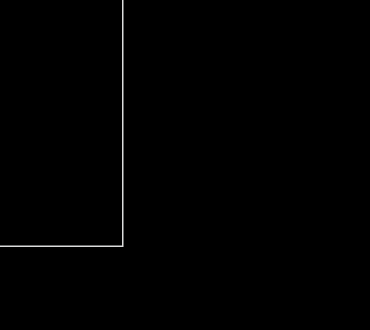
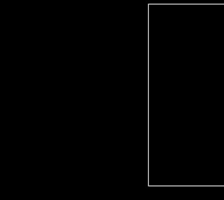

# Polygon subdivision

A program to demonstrate a recursive polygon subdivision algorithm as an interactive simulation and library. It features stop searching condition for subdivisions if it is out of bounding box. Supports division up to 16x16. With a very small modification, it is possible to divide even much more. The aim of this limitation is to use fixed memory that can be used in the future in C code. 
[Introduction to Recursion at GeeksforGeeks](https://www.geeksforgeeks.org/dsa/introduction-to-recursion-2/)  provides a simple concept of recursive algorithm to learn the basics. 

Polygon subdivision in 3D graphics is used to divide a large polygon into smaller polygons to filter what polygons are in view space. This ensures that only the visible polygons are drawn by GPU's rasterizer. Note that clipping is done in screen space not in clip space (frustum clipping).

    
	
<i>Recursive 16x16 subdivision algorithm live.</i>

 

    
	
<i>Interactive simulation 16x16 subdivision live.</i>

 

    
	
<i>Full 8x8 subdivision live.</i>

 

# Code
Source code and application are available for Java.
Actual source code for Java library can be found in folder _org.Subdivision_. 
The program has two main functions.

* Practical usage how to call function:
src\org\Subdivision\MainPracticalDemo.java
  - It contains clean code to apply.
* Modified version to simulate on display:
src\org\SubdivisionSimulation\MainSubdivisionSimulation.java
  - Is modified in such a way to update display at every little update during calculation.
 
There is an easter egg hidden in the code!  

**Author:** MSc Jiří Fajta 
**Code implementation date:** 2026 
